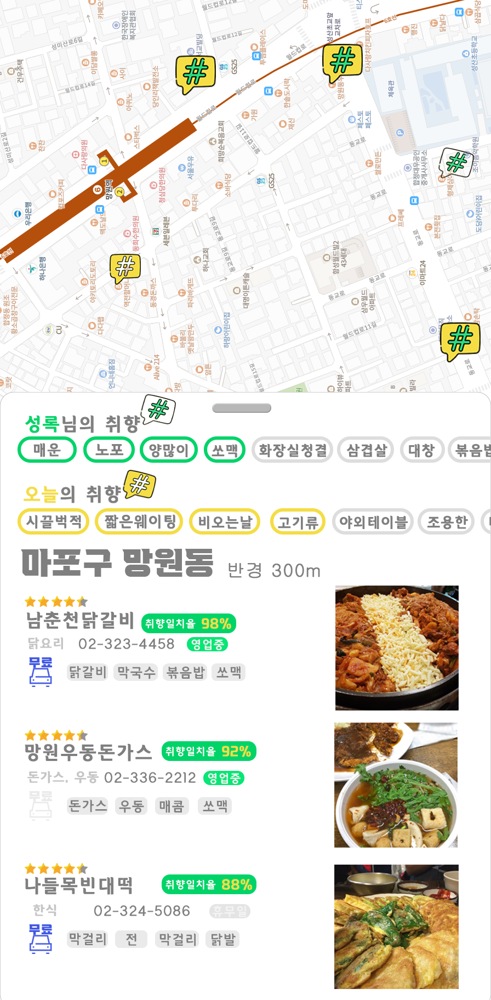

# 심야식당

    

## 퍼스널 맛집 추천 서비스

- 리뷰 많은 순, 평점순인 숫자로만 차가운 추천 서비스가 아닌 취향에 맞춰 추천해주는 맛집 어플

### 구현 방안

1. 서울시 모든 영업 중인 모든 [음식점 데이터](http://data.seoul.go.kr/dataList/OA-16094/A/1/datasetView.do) 확보
2. 네이버지도, 카카오맵, 인스타그램 크롤링
    
    <aside>
    ✂️ 사업장명, 도로명주소, 우편번호, 리뷰, 평점(평점없음), 리뷰개수(0)
    
    </aside>
    
3. 크롤링해온 자료 중에서 리뷰를 키워드화 한다.
4. 키워드화된 리뷰/ 평점/리뷰개수를 사업장명, 도로명주소(or우편번호)를 PK로 음식점 데이터에 접합한다.
5.  추가해야할 자료
(생각하시는 자료가 있으시다면 업데이트 해주세요.)
    
    <aside>
    💡 웨이팅 정도,
    
    </aside>
    
6. 키워드를 토픽별로 묶는다
7. 모델 설정
개인 A가 홍대에서 맛집을 찾는다면 A가 썼던 리뷰(키워드화)와 매칭한 수가 가장 많은 주변 음식점을 추천 순위별로 보여준다.
8. 음식점 정보

<aside>
✅ 사업장명, 사업장전화번호, 현위치와의 거리, 매칭 많이된 키워드, 주메뉴, 웨이팅여부(검색시간대에 평균 웨이팅시간)
</aside>

### 예상 구현 화면

    
    

## Our Notion : 
